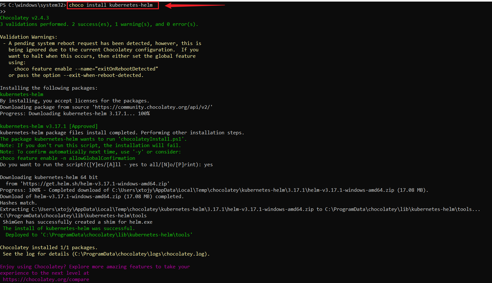
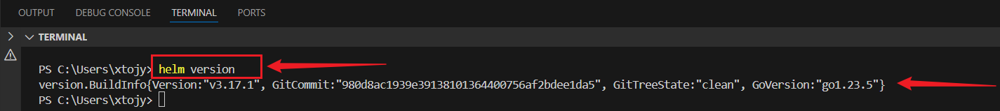
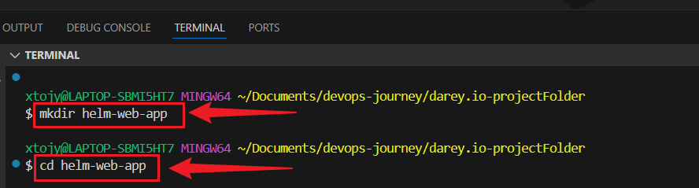

# 🚀 Deploying a Web Application Using Helm in Kubernetes

This project demonstrates how to deploy a simple web application to a Kubernetes cluster using **Helm**, a powerful package manager for Kubernetes. It includes the setup of Helm, customization of a Helm chart, and deployment of the application.

---

## ✅ Prerequisites

Before you begin, make sure the following tools are installed and configured:

- A working Kubernetes cluster (e.g., Minikube, Kind, or cloud-based)
- `kubectl` installed and configured
- Docker
- Git
- Helm 3
- Jenkins for CI/CD (Optional) 


## 📥 Install Helm

### On Windows
```
choco install kubernetes-helm
```



## Verify installation:
```
helm version
```


---


## 1: Create a new project directory:
```
mkdir helm-web-app
cd helm-web-app
```


---

## 2: 🛠️ Create a Helm Chart
```
helm create webapp
```
---

## 3: Initialize Git:
```
git init
git add .gitignore
git add .
git commit -m "Initial Helm chart"
```

## Push to remote repository:
```
git remote add origin <REMOTE_REPOSITORY_URL>
git push -u origin master
```

---


## ✅ Conclusion
This project shows how Helm can simplify Kubernetes application deployments through templated configuration and version-controlled charts. Helm not only helps maintain consistency across environments but also empowers teams to deploy and manage applications at scale with confidence.
